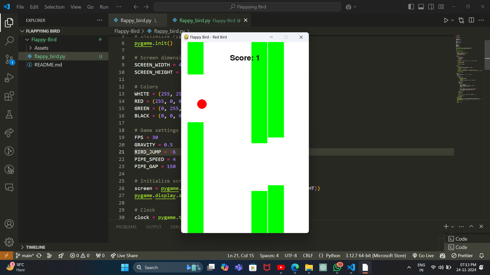
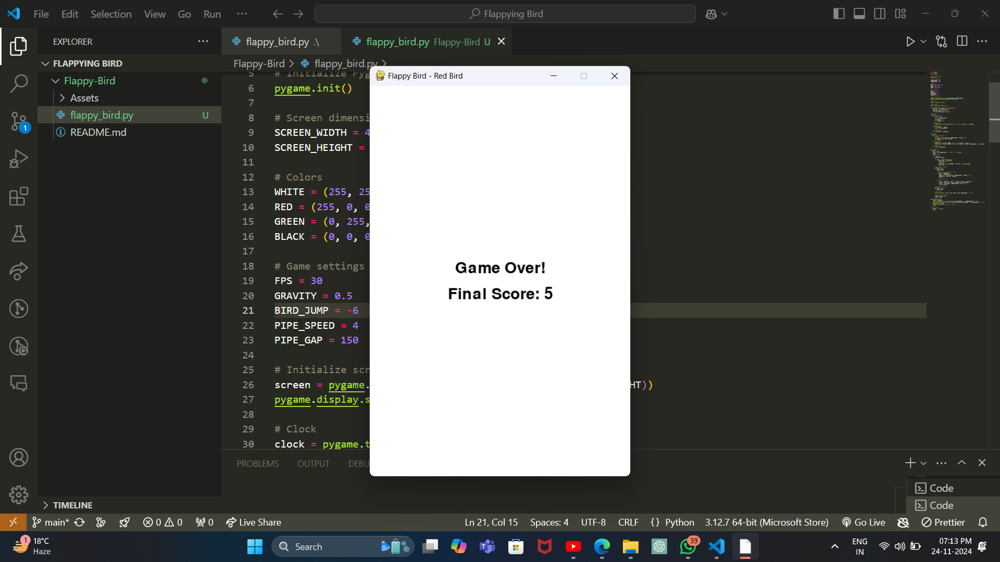

# Flappy Bird

A simple Flappy Bird game implemented in Python using the Pygame library. The game features a red bird navigating through green pipes, with gravity and collision mechanics.

## Table of Contents
- [About the Project](#about-the-project)
- [Features](#features)
- [Getting Started](#getting-started)
- [How to Play](#how-to-play)
- [Screenshots](#screenshots)
- [Contact](#contact)

---

## About the Project

This project recreates the classic Flappy Bird game using Python and Pygame. It serves as a great starting point for understanding game development basics, including physics, collision detection, and dynamic object rendering.

---

## Features
- **Red Bird**: Player-controlled character.
- **Green Pipes**: Dynamic obstacles.
- **Score System**: Tracks the player's progress.
- **Game Over Screen**: Displays the final score when the game ends.
- **Replay Functionality**: Automatically restarts after displaying the game over screen.

---

## Getting Started

### Prerequisites
- Python 3.7 or later
- Pygame library

Install Pygame using pip:
```bash
pip install pygame
```

### Clone the Repository
```bash
git clone https://github.com/ayushraj6824/Flappy-Bird.git
cd Flappy-Bird
```

### Run the Game
```bash
python flappy_bird.py
```

---

## How to Play
- **Press the Spacebar** to make the bird jump.
- Navigate through the gaps between the pipes.
- Avoid colliding with the pipes or the ground to keep playing.
- Your score increases as you pass through pipes.

---

## Screenshots

### Gameplay

Example:


### Game Over Screen
*(Add your screenshots here)*

Game Over:


---

## Contact
If you have any questions or feedback, feel free to reach out:

- **GitHub**: [ayushraj6824](https://github.com/ayushraj6824)
```
